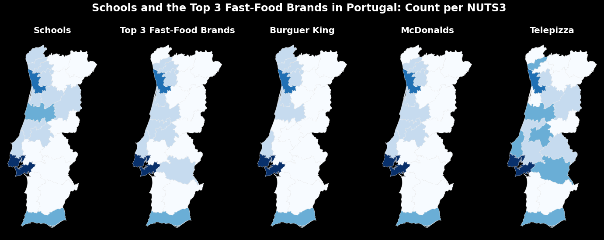

# Fast Food and Schools in Portugal

(please note the code of Goal#3 is not cleaned/commented and the R part has not been uploaded yet)

This repository contains the code I wrote for the thesis of my Master in Clinical Nutrition.
Below are the graphic results I obtained.

## Major question of the study:
How accessible is fast-food to Portuguese school-aged children, around their schools?

## Data

## GOAL #1 Calculate the distance between each school and its closest fast-food restaurant, and identify the regions where that distance is smaller.

## GOAL #2 Calculate the distance between each school and its closest fast-food restaurant, and identify the regions where that distance is smaller.

## GOAL #3 Find whether the fast-food restaurants cluster around schools  or their location is spatially-independent.

